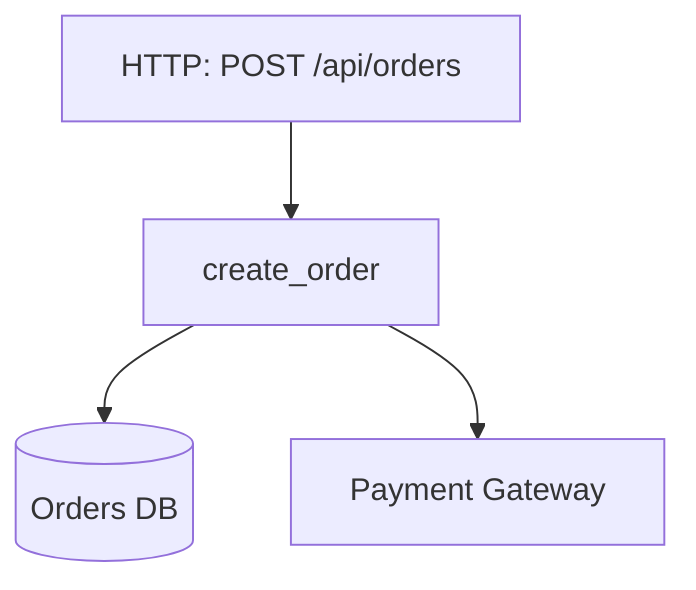

# 中文示例

用这个示例校准输入形态、证据表达方式和最终输出密度。不要复用其中的业务结论到真实项目；只复用结构和证据标准。

## 示例输入

```yaml
request: 请输出最核心的一个入口流程，使用 markdown

entrypoints:
  - type: route
    trigger: POST /api/orders
    file: apps/api/routes/orders.py
    symbol: create_order_route
  - type: message
    trigger: topic.order_paid
    file: apps/worker/consumers/payment_consumer.py
    symbol: handle_order_paid
  - type: schedule
    trigger: "*/5 * * * * inventory-reconcile"
    file: apps/worker/jobs/inventory_job.py
    symbol: run_inventory_reconcile

symbols:
  - file: apps/api/routes/orders.py
    symbol: create_order_route
    calls:
      - services.order_service.create_order
  - file: services/order_service.py
    symbol: create_order
    calls:
      - repositories.order_repo.insert_order
      - integrations.payment_gateway.create_payment
  - file: apps/worker/consumers/payment_consumer.py
    symbol: handle_order_paid
    calls:
      - services.fulfillment_service.confirm_payment
  - file: services/fulfillment_service.py
    symbol: confirm_payment
    calls:
      - repositories.order_repo.mark_paid
      - integrations.wms_client.reserve_stock

deps:
  - from: services.order_service.create_order
    to: repositories.order_repo.insert_order
    type: db
  - from: services.order_service.create_order
    to: integrations.payment_gateway.create_payment
    type: third_party
  - from: services.fulfillment_service.confirm_payment
    to: repositories.order_repo.mark_paid
    type: db
  - from: services.fulfillment_service.confirm_payment
    to: integrations.wms_client.reserve_stock
    type: third_party
```

## 示例输出

```markdown
# Project Anchor Map

## 最核心的 1 条入口流程

### 1. 下单并创建支付单

- 业务价值: 直接对应下单与收款起点，是收入链路的首个核心入口。
- 入口锚点: Route `POST /api/orders`
- 核心调用路径:
  1. `apps/api/routes/orders.py::create_order_route`
  2. `services/order_service.py::create_order`
  3. `repositories/order_repo.py::insert_order`
  4. `integrations/payment_gateway.py::create_payment`
- 关键实现入口: `services/order_service.py::create_order`
- 外部依赖: Orders DB, Payment Gateway
- 风险点: No explicit transaction boundary evidence found between order insert and payment creation. No explicit idempotency evidence found on route handler path.
- 证据:
  - `apps/api/routes/orders.py :: create_order_route`
  - `services/order_service.py :: create_order`
  - `repositories/order_repo.py :: insert_order`
  - `integrations/payment_gateway.py :: create_payment`

## Mermaid 总览图



## 新同学阅读顺序

1. `apps/api/routes/orders.py::create_order_route`
2. `services/order_service.py::create_order`
3. `repositories/order_repo.py::insert_order`
4. `integrations/payment_gateway.py::create_payment`
5. `apps/api/routes/orders.py::create_order_route`
```

## 双视角示例标题

当用户说“同时输出业务视角和核心链路视角”时，可使用如下章节骨架：

```markdown
# Project Anchor Map

## 核心入口流程

### 业务价值视角
...

### 核心链路视角
...

## Mermaid 总览图
...

## 新同学阅读顺序
...
```

## 按模块示例标题

当用户说“按模块分别输出核心入口流程”时，可使用如下章节骨架：

```markdown
# Project Anchor Map

## 按模块拆分的核心入口流程

### 模块：Orders
...

### 模块：Payments
...

## Mermaid 总览图
...

## 新同学阅读顺序
...
```

## 使用提示

- 如果用户明确要求 `markdown`，不要输出 JSON 包裹、XML 标签或自定义块格式。
- 如果用户说“业务价值最高”，优先按业务价值排序；如果用户说“最核心”“核心链路”，优先按核心链路排序。
- 如果用户说“全部”“一个”“十个”“最核心”，要先解析数量要求，再决定输出条数。
- 如果用户说“按模块”“按域”“分别输出”，要先分组，再在组内排序。
- 如果用户说“两种视角都给出”“业务和技术都看”，要输出业务价值视角与核心链路视角两个章节。
- 如果输入只给了 `symbols/deps/entrypoints`，就按这些数据先组装路径，再明确标出证据缺口。
- 如果同时能读源码，优先把示例里的抽象依赖名替换成真实文件路径和符号。
- 如果无法证明鉴权、事务、幂等、重试、补偿存在，不要默认它们存在。
