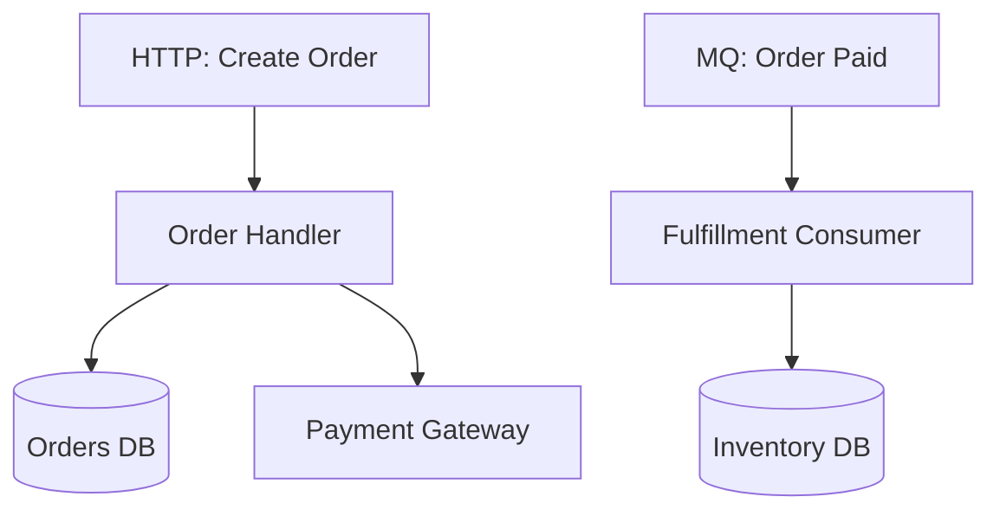

# Output Contract

The final artifact must be standard Markdown.

Use this exact section order in the final answer:

1. `Project Anchor Map`
2. `<按用户意图生成的入口流程章节标题或多章节入口流程区块>`
3. `Mermaid 总览图`
4. `新同学阅读顺序`

## Section Title Rules

Choose the second section title from user intent:

- business-value intent: `高业务价值入口流程`
- core-path intent: `核心链路入口流程`
- mixed or unspecified intent: `核心入口流程`

If the user asked for a quantity, include it in the heading when natural, for example:

- `最核心的 1 条入口流程`
- `前 10 条高业务价值入口流程`
- `全部已证实入口流程`

If the user asked for grouped or dual-view output, use headings like:

- `按模块拆分的核心入口流程`
- `业务价值视角`
- `核心链路视角`

## Grouped Output Rules

When the user asks for module/domain/system grouping:

- add one subheading per group
- within each group, rank anchors using the requested ranking mode
- state the grouping basis briefly, for example `分组依据：按 apps/api 与 apps/worker 目录`

Example:

```markdown
## 按模块拆分的核心入口流程

### 模块：Orders
...

### 模块：Payments
...
```

## Dual-View Rules

When the user asks for both business and technical/core views:

- produce two sibling sections under the main anchor section
- keep quantity constraints consistent across both views unless the user asks otherwise
- add a one-line comparison if the selected anchors differ materially

## Anchor Template

Repeat this structure for each selected entry flow:

```markdown
### 1. <Anchor title>

- 业务价值: <why this path matters, evidence-based and concise>
- 入口锚点: <route/message/schedule/CLI + concrete trigger>
- 核心调用路径:
  1. <step 1>
  2. <step 2>
  3. <step 3>
- 关键实现入口: <function/class/file>
- 外部依赖: <DB/MQ/third-party only if evidenced>
- 风险点: <auth/transaction/idempotency/retry/compensation with evidence-aware phrasing>
- 证据:
  - `<file path> :: <symbol>`
  - `<file path> :: <symbol>`
```

## Evidence Standard

Every anchor must include at least:

- one entrypoint evidence item
- one implementation evidence item
- enough evidence to justify each named dependency

If a risk statement is negative evidence, phrase it explicitly:

- `No explicit auth guard evidence found in inspected path`
- `No explicit retry wrapper evidence found around outbound call`

## Ranking Guidance

Respect explicit quantity requests first.

- If the user asks for `all`, return all evidenced anchors.
- If the user asks for `1` or `最核心`, return 1 unless the prompt clearly asks for multiple core candidates.
- If the user gives no quantity, default to 10.

Support two ranking modes:

- `业务价值优先`: revenue, primary user journey, operational delivery, support, internal tooling
- `核心链路优先`: orchestration centrality, downstream coverage, state propagation importance, reuse by other flows

Prefer anchors that a newcomer must understand to explain:

- how money is made
- how the primary user journey works
- how state changes propagate
- how failures are recovered

If business-value and core-path rankings differ materially, state which ranking mode was applied.
If grouped output is requested, apply the ranking mode inside each group rather than globally unless the user explicitly asks for a global ranking.

## Mermaid Guidance

Use a single high-level Mermaid flowchart. Keep it readable and cluster by entrypoint type or domain. Include only the selected anchors, not every internal helper.

Example shape:



## Onboarding Reading Order

Recommend a practical reading sequence of 5-8 items:

- start from the highest-value entrypoint
- then the main orchestration/service layer
- then persistence and integration adapters
- end with cross-cutting concerns such as auth, retries, and jobs

Each item should reference a file path and symbol when possible.

If only 1 anchor is requested, the onboarding order may be shorter than 5 items.
If grouped or dual-view output is requested, the onboarding order should still be a single practical read path rather than duplicating every group.
